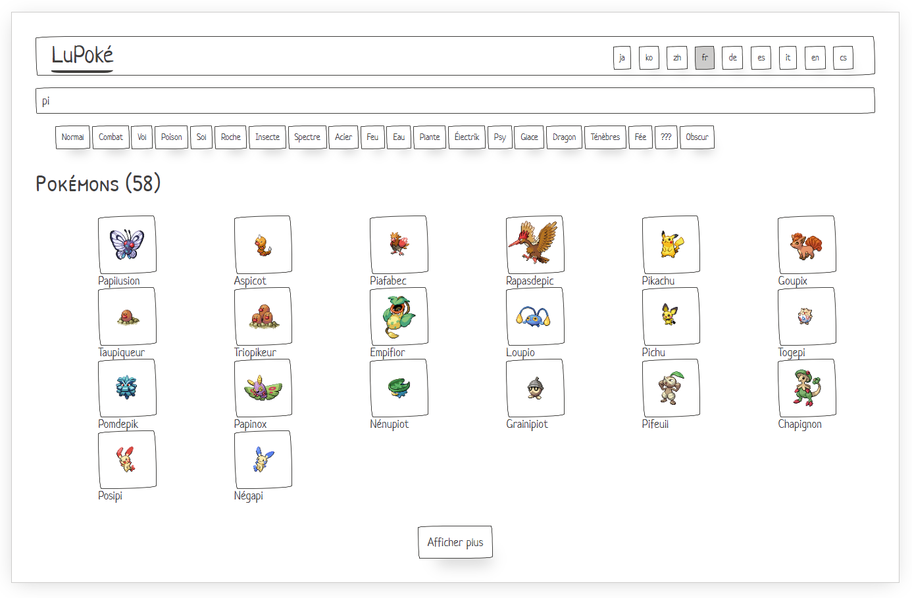

# AtelierSignalState

This project uses Angular version 17.0.0-next.6.
And a copy of the code provided [here](https://github.com/markostanimirovic/ngrx-signal-store-playground) as part of the [RFC about SignalStore](https://github.com/ngrx/platform/discussions/3796).

This playground gives you a simple page with some available APIs. Models and http services are ready, all business logic can be implemented!

An implementation example can be found [here](https://github.com/GuillaumeNury/AtelierSignalState/tree/signal-store).

## Install

> npm ci

## Start

> npm start
